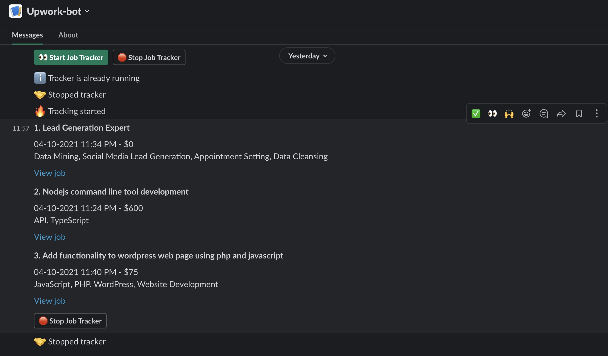

# Upwork Job Tracker bot for Slack
This is a fun project which automates the job searching in Upwork. It's very tough for me to be active in Upwork to bid on jobs while doing 9 to 5 job. To save time, this bot will track the jobs and notify in slack when it meets target criteria. This bot will notify after every 10 minute.

### Commands
```sh
# to run tests
yarn run test 

# to start server
yarn start
```

